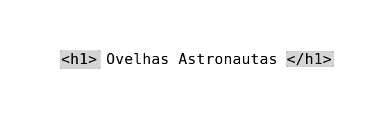
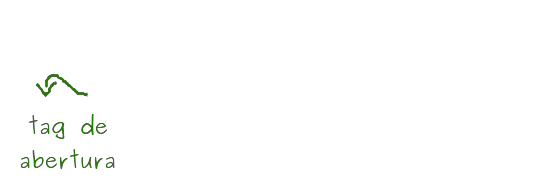
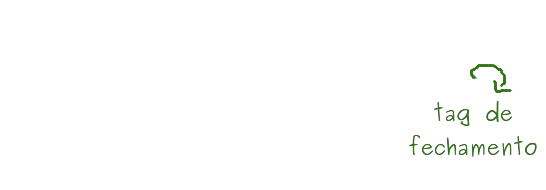
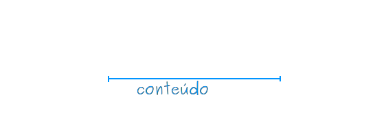
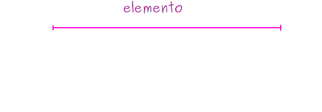

<!-- {"layout": "title"} -->
# Programação Web usando <br>HTML e CSS
## História da Web, Plantas Carnívoras, Ingredientes do HTML (_tags_) e Temperando com CSS


---
<!-- {"layout": "regular"} -->
# hoje vamos...

1. Entender a [história da Web](#web-igual-internet)
1. Conhecer os [principais componentes da Web](componentes-web)
1. Conhecer a [estrutura básica](#estrutura-basica-html) de um arquivo HTML
1. Aprender algumas [_tags_ HTML para texto](#tags-html):
   - parágrafos `<p>...</p>`
   - títulos `<h1>...</h1>`, ou `<h2>...</h2>` etc. (até `<h6>...</h6>`)
   - imagens ``
   - hiperlinks `<a href="">...</a>`
1. Entender um pouco de [estilo CSS](#estilo-css):
   - `color`, `background-color`
   - `margin`, `text-align`
---
<!-- {"layout": "section-header", "slideHash": "web-igual-internet"} -->
# Web == Internet?
## A Web é a mesma coisa que a Internet?

- Personagens da história
- Surgimento da Internet
- Internet pré-web

<!-- {ul:.content} -->
---
<!-- {"layout": "regular"} -->
# Fatos importantes

Surgimento:
  ~ A **Internet** <!-- {.alternate-color} --> surgiu em 1969 com o nome
    de ARPANET
  ~ A **Web** surgiu entre 1989 e 1993

Criadores:
  ~ A **Internet** <!-- {.alternate-color} --> foi criada por pesquisadores
    nos EUA
  ~ A **Web** foi criada por um pesquisador na Europa

Fato:
  ~ A **Internet** <!-- {.alternate-color} --> é a maior rede de computadores
  ~ A **Web** é "um dos programas" (o maior) na Internet

Dúvidas:
  ~  <!-- {.portrait.push-right} -->
    (a) Internet é com "I" ou com "i"?
  ~ (b) Como surgiu a Internet?


---
<!-- {"layout": "main-point", "state": "emphatic", "slideHash": "internet-pre-web"} -->
# Dúvida...
## Mas se a Web surgiu apenas em 1989, o que era a Internet antes dela?

::: figure .floating-portrait-container
 <!-- {.portrait} -->
:::

---
::: figure

<figcaption>Cliente de E-mail ELM (1986)</figcaption>
:::

---
::: figure

<figcaption>Cliente de E-mail Pine (1989)</figcaption>
:::

---
::: figure

<figcaption>BBS Koala Country (1989)</figcaption>
:::

---
::: figure . height: calc(90% - 3em)
<figcaption>Usenet GNUs</figcaption>


:::

---
::: figure . height: calc(90% - 3em)
<figcaption>Gopher de Jospeh Maistre</figcaption>


:::

---
<!-- {"layout": "regular"} -->
## A era Pré-web

- O que mais se aproximava de **troca organizada de documentos** era o
  **Gopher**
- O Gopher considerou que a melhor forma para apresentar a
  informação era de **forma hierárquica**
  - Contudo, hierarquizar a informação não é fácil, nem para fazer, nem para ler
- A _World Wide Web_ (WWW), proposta por Tim Berners-Lee, apresenta a
  informação em "formato de teia"

---
<!-- {"layout": "section-header", "slideHash": "definicao-web"} -->
# O que é a Web
## Definição e Composição

- Definição de Web
- Linguagens da Web

<!-- {ul:.content} -->

---
<!-- {"layout": "regular"} -->
## Definição **(~~in~~formal)** de Web

- **World Wide Web**, ou WWW, traduz em "teia mundial"
  - Normalmente falamos apenas: a **Web**

1ª definição
  ~ É o que estamos vendo e interagindo quando abrimos um navegador
    (Chrome, Firefox etc.)

2ª definição
  ~ Um conjunto de documentos de **hipermídia** **interconectados**, tipicamente
    acessados pela Internet. Esses documentos são as **páginas web**.
    - **Hipermídia**: conteúdo digital que envolve texto, imagens, sons,
      vídeos etc.
    - **Interconectado**: um documento contém "links" (referências) a outros
      (daí a ideia de teia :spider_web:)

<!-- {dl:.bulleted} -->

---
<!-- {"layout": "regular"} -->
## Definição **(formal)** de Web

Segundo Andrew Tanembaum (autor de vários livros de Computação):

> A Web é um **arcabouço arquitetural** para acessar<br>
> **conteúdo relacionado** que está espalhado em milhões<br>
> de computadores pela Internet.

<!-- {blockquote:.centered} -->

"Arcabouço arquitetural"
  ~ Conjunto de regras para a descrição, visualização e transmissão das
    páginas web

"Conteúdo relacionado"
  ~ As páginas podem conter referências (_links_, ou melhor, _hyperlinks_) para
    outras páginas

<!-- {dl:.width-40} -->

---
<!-- { "layout": "2-column-highlight-and-list" , "slideHash": "o-que-compoe-web"} -->

## O que **compõe** uma página web?

<figure style="height: 80%">
  <figcaption><a href="https://fegemo.github.io/cefet-web-ovelhas/racas-raras.html"><code>racas-raras.html</code></a></figcaption>
  <iframe src="https://fegemo.github.io/cefet-web-ovelhas/racas-raras.html" height="90%" width="100%">
    
  </iframe>
</figure>

- Uma página web é formada por **arquivos**:
  - **01** arquivo no formato HTML (*e.g.*, `racas-raras.html`)
  - Arquivos CSS (*e.g.*, `estilo.css`)
  - Arquivos JavaScript (*e.g.*, `ovelhita.js`)
  - Imagens (`.png`, `.jpg`, `.gif`)
  - Vídeos etc.

*[HTML]: Hypertext Markup Language*
*[CSS]: Cascading Stylesheets*

---
<!-- {
  "layout": "3-column-element-with-titles-expansible",
  "preventSelection": "code"
} -->

##  <!-- {.emoji} --> `racas-raras.`**`html`**

```html
<!DOCTYPE html>
<html>
  <head>
    <meta charset="utf-8">
    <meta name="viewport" content="width=device-width">
    <title>Raças Raras de Ovelhas</title>
    <link rel="stylesheet" href="estilos.css">
    <link rel="shortcut icon" href="favicon.ico" type="image/x-icon" />
  </head>
  <body>
    <h1>Raças <strong>Raras</strong> de Ovelhas</h1>
    <p>O interessante animal da espécie <em>Ovis aries</em> (vulga ovelha) é
      tipicamente produzido (pela natureza) em raças distintas. Em cada uma
      delas, os indivíduos ovelhísticos possuem características fisiológicas e
      comportamentais diferentes.</p>
    <p>A seguir, veja alguns exemplos dessas raças.</p>
    <h2>Algod-ovelha</h2>
    
    <p>Em vez de lã, esta ovelha é uma exímia produtora de algodão e
      muito apreciada pela indústria têxtil chinesa.</p>
    <p>Pessoas pagam milhões para poder criar destas em suas casas.</p>
    <h2>Pirá-tovelha</h2>
    
    <p>Ovelha marinha-saqueadora frequentemente vista nas ilhas caribenhas
      (seu habitat) navegando embarcações de madeira.</p>
    <p>Ao avistar uma destas, gire o leme completamente a estibordo, ice as
      velas e fuja para terra firme.</p>
    <h2>Ovelhopixel</h2>
    
    <p>Uma ovelha digital formada por um conjunto de quadradinhos coloridos.</p>
    <p>Ela precisa se recarregar de tempos em tempos.</p>
    <h2>Outras</h2>
    <ul>
      <li>Robôvelha</li>
      <li>Ninjo-velha</li>
      <li>Legovelha</li>
    </ul>
    <figure id="ovelha" class="sprite">
      
    </figure>
    <script src="shake.js" charset="utf-8"></script>
    <script src="ovelhinha.js" charset="utf-8"></script>
  </body>
</html>
```

##  <!-- {.emoji} --> `estilos.`**`css`**

```css
body {
  margin: 0 auto;
  max-width: 600px;
  border-left: 3px double silver;
  border-right: 3px double silver;
}

h1 {
  margin-top: 0;
  font-family: "Comic Sans", cursive;
  font-weight: normal;
  color: purple;
}

h2 {
  clear: both;
  color: black;
  font-family: "Comic Sans", cursive;
  background-image: linear-gradient(to right, yellow 1%, rgba(255,255,255,.5) 1%, transparent);
  padding: 0.15em 0.15em 0.15em 1em;
}

.circular {
  border-radius: 50%;
  shape-outside: circle(50%);
}

.foto-ovelha {
  display: inline-block;
  width: 125px;
  border: 2px solid yellow;
  box-shadow: 3px 3px 3px silver;
}

p {
  text-align: justify;
  line-height: 1.5em;
}

ul {
  list-style-image: url(ovelhinha.gif);
}

.sprite {
  width: 40px;
  height: 40px;
  overflow: hidden;
  position: fixed;
  bottom: 0;
  right: 0;
  margin: 0;
  cursor: move;
}

.sprite.invertido {
  transform: rotateY(.5turn);
}

.sprite > img {
  position: absolute;
  top: calc(-1*40px);
  left: calc(-3*40px);
}

.sprite.parado > img {
  top: calc(-1*40px);
  left: calc(-3*40px);
  animation: parado 1.5s steps(1) 1;
}

@keyframes parado {
  100% { left: calc(-3*40px); }
}
```

##  <!-- {.emoji} --> `ovelhita.`**`js`**

```js
const ANIMACOES = ['parado', 'andando', 'correndo', 'rolando', 'virando',
  'adormecendo', 'dormindo', 'despencando', 'despencado', 'pendurada'];

const ESTADOS = {
  reflexiva: { loop: 'parado', proximo: ['dormindo', 'andando', 'reflexiva'] },
  dormindo: { loop: 'dormindo', pre: 'adormecendo', pos: { anim: 'parado', duracao: 500 }, proximo: ['andando', 'reflexiva'] },
  andando: { loop: 'andando', proximo: ['andando', 'reflexiva', 'virando', 'correndo'] },
  correndo: { loop: 'correndo', proximo: ['andando', 'correndo'] },
  virando: { loop: 'virando', proximo: ['reflexiva', 'andando'] },
  rolando: { loop: 'rolando', proximo: ['reflexiva', 'dormindo'] },
  pendurada: { loop: 'pendurada', proximo: ['despencando'] },
  despencando: { loop: 'despencando', pos: { anim: 'despencado', duracao: 2000 }, proximo: ['reflexiva']}
};

const vibraTela = () => {
  // chama a vibração da bateria, se houver
  if ('vibrate' in navigator) {
    navigator.vibrate(1000);
  }

  // faz os elementos dentro do tela tremerem
  document.body.classList.add('vibrando');
  document.body.addEventListener('animationend', function(e) {
    e.target.removeEventListener(e.type, arguments.callee);
    document.body.classList.remove('vibrando');
  });
};

let ovelha = {
  el: document.querySelector('#ovelha'),

  // estado inicial
  estado: ESTADOS.reflexiva,
  tempoNoEstado: 0,
  estadosAnteriores: [],
  orientacao: 1,

  // define qual animação será tocada
  defineAnimacao: function(nomeAnimacao) {
    ANIMACOES.forEach((anim) => this.el.classList.remove(anim));
    this.el.classList.add(nomeAnimacao);
  },

  // define se a ovelha está olhando para esquerda ou direita
  defineOrientacao: function(novaOrientacao) {
    if (novaOrientacao <= 0) {
      this.el.classList.add('invertido');
    } else {
      this.el.classList.remove('invertido');
    }
    this.orientacao = novaOrientacao;
  },

  largura: 40,
  altura: 40,
  // coordenadas definem a posição do centro da ovelha
  x: 20,
  y: 20,
  // sistema de coordenadas começa na direita e embaixo
  definePosicao: function(x, y) {
    this.x = x;
    this.el.style.right = `${x - this.largura/2}px`;
    if (!!y) {
      this.y = y
      this.el.style.bottom = `${y - this.altura/2}px`;
    }
  },

  // invocada quando quisermos trocar o estado
  mudaEstado: function(novoEstado) {    
    switch (novoEstado) {
      case ESTADOS.despencando:
        this.velocidadeY = 0;
        break;
    }

    this.estadosAnteriores.unshift(this.estado);
    while (this.estadosAnteriores.length > 3) {
      this.estadosAnteriores.pop();
    }
    this.estado = novoEstado;
    this.tempoNoEstado = 0;
  },

  sorteiaProximoEstado: function() {
    return ESTADOS[this.estado.proximo[Math.floor(Math.random() * this.estado.proximo.length)]];
  },

  bateuNaTela: function() {
    return (this.x - this.largura/2 < 0 || this.x + this.largura/2 > window.innerWidth);
  },

  saiuDaTela: function() {
    return (this.x + this.largura/2 < 0 || this.x - this.largura/2 > window.innerWidth);
  },

  revolucionaNaTela: function() {
    let newX;
    if (this.x - this.largura/2 < 0) {
      newX = this.x + window.innerWidth + this.largura/2;
    } else if (this.x + this.largura/2 > window.innerWidth) {
      newX = -this.largura/2;
    }
    this.definePosicao(newX);    
  },

  passouDoChao: function() {
    return (this.y - this.altura/2 < 0);
  },

  tempoAntes: 0,
  atualiza: function(tempo) {
    let delta = tempo - this.tempoAntes;
    this.tempoNoEstado += delta;

    switch (this.estado) {
      case ESTADOS.reflexiva:
        if (this.tempoNoEstado > 1000) {
          this.mudaEstado(this.sorteiaProximoEstado());
        }
        break;

      case ESTADOS.dormindo:
        if (this.tempoNoEstado > 4000) {
          this.mudaEstado(this.sorteiaProximoEstado());
        }
        break;

      case ESTADOS.andando:
        this.definePosicao(this.x += this.orientacao * .025 * delta);
        if (this.tempoNoEstado > 3000) {
          this.mudaEstado(this.sorteiaProximoEstado());
        }
        if (this.saiuDaTela()) {
          this.revolucionaNaTela();
        }
        if (this.bateuNaTela() && this.estadosAnteriores.indexOf(ESTADOS.virando) === -1) {
          this.mudaEstado(ESTADOS.virando);
        }
        break;

      case ESTADOS.correndo:
        this.definePosicao(this.x += this.orientacao * .085 * delta);
        if (this.tempoNoEstado > 2500) {
          this.mudaEstado(this.sorteiaProximoEstado());
        }
        if (this.saiuDaTela()) {
          // dá a volta na tela
          this.revolucionaNaTela();
        }
        break;

      case ESTADOS.virando:
        // 500ms é o mesmo tempo definido na animação em CSS
        if (this.tempoNoEstado > 500) {
          this.defineOrientacao(this.orientacao * -1);
          this.mudaEstado(this.sorteiaProximoEstado());
        }
        break;

      case ESTADOS.rolando:
        // rola até bater na tela
        this.definePosicao(this.x += this.orientacao * .085 * delta);
        if (this.bateuNaTela()) {
          this.mudaEstado(this.sorteiaProximoEstado());
        }
        break;

      case ESTADOS.despencando:
        // vai caindo até atingir o chão
        this.definePosicao(this.x, this.y += this.velocidadeY * .085 * delta);
        this.velocidadeY -= 0.025;
        if (this.passouDoChao()) {
          this.definePosicao(this.x, this.altura/2);
          vibraTela();
          this.mudaEstado(this.sorteiaProximoEstado());
        }
        break;        
    }

    if (!this.deveParar) {
      requestAnimationFrame(this.atualiza.bind(this));
    }
    this.deveParar = false;
    this.tempoAntes = tempo;
  },

  para: function() {
    this.deveParar = true;
  }
};


ovelha.inicializa();
```

---
<!-- { "layout": "circling-balloons" } -->
## As três linguagens

- 

  Linguagem:
    ~ HTML: Hypertext Markup Language

  O que faz:
    ~ Conteúdo e estrutura da página (*e.g.*, o texto, imagens)

- 

  Linguagem:
    ~ CSS: Cascading Stylesheets

  O que faz:
    ~ Apresentação (estilos) da página (*e.g.*, core, tamanhos, detalhes)

- 

  Linguagem:
    ~ JavaScript

  O que faz:
    ~ Comportamento dinâmico na página (*e.g.*, a ovelhita)

---
<!-- {
  "layout": "2-column-highlight-and-list",
  "embeddedStyles": ".titulo-raras-ovelhas { color: purple; font-family: 'Comic Sans', cursive; font-weight: normal; border-bottom: 2px solid currentColor; }"
} -->
## A página das **Raras Ovelhas** <!-- {.titulo-raras-ovelhas} -->


- O arquivo HTML referencia (usa, inclui) os arquivos de imagem, os arquivos
  de estilo e os de script. Por exemplo:
  - Incluindo imagem:
    ```html
    
    ```
  - Referenciando um arquivo CSS:
    ```html
    <link href="estilos.css" rel="stylesheet">
    ```


---
<!-- {"layout": "section-header", "slideHash": "componentes-web"} -->
# Surgimento da Web
## As principais façanhas de Tim: Os 5 componentes básicos  da Web

- HTML
- Navegador
- Servidor
- Protocolo HTTP
- Primeira página Web (http://info.cern.ch)
<!-- {ul:.content} -->

---
<!-- { "layout": "regular"} -->
## Tim, o Coração Valente

- ::: figure .floating-portrait-container.push-right
   <!-- {.portrait} -->
  :::
  **Físico**, trabalhando no CERN, **Tim Berners-Lee** percebeu a necessidade
  dos físicos de compartilhar informação e a falta de máquinas ou formatos
  comuns
- **Em 1989**, Tim escreveu uma proposta: _"a large hypertext database with typed
  links"_
- Candidatos a nomes:
  - _Information Mesh_
  - _The Information Mine_
  - _Mine of Information_
  - **_World Wide Web_**

*[CERN]: Conseil Européen pour la Recherche Nucléaire*
---
<!-- {"layout": "main-point", "state": "emphatic"} -->
## Tim, o coração valente, tinha uma dúvida

 <!-- {.portrait.push-left} -->
Quero que **qualquer pessoa**, em **qualquer computador** , em qualquer lugar, consiga **visualizar documentos um do
outro**.

Mais que isso, os documentos podem **referenciar um ao outro não necessariamente
de forma hierárquica**. E quero que eles possam conter imagens, tabelas, títulos
e outras coisas legais.

---
<!-- {"layout": "regular"} -->
## HyperText Markup Language (HTML)

- É um _formato de arquivo_ (`.html`) em texto simples (*plain-text*) em que
  **seleciona-se um texto** e **marca suas partes dando a ele estrutura**

  Texto puro:
    ~ ```html
      Este é um texto sem ênfases.
      ```

  Texto html:
    ~ ```html
      Este é um texto com um trecho <em>enfatizado</em>.
      ```

---
<!-- {"layout": "regular"} -->
## Um **arquivo `html`** completo

- `pagina-singela.html`:
  ```html
  <!DOCTYPE html>
  <html>
  <head>
    <title>Uma página web!</title>
  </head>
  <body>
    Olá pessoal, esta é uma página com apenas este singelo texto!
  </body>
  </html>
  ```

---
<!-- {"layout": "main-point", "state": "emphatic"} -->
## Tim, o coração valente, tinha uma dúvida

 <!-- {.portrait.push-left} -->
Agora que especifiquei um formato de arquivo robusto, preciso de um **programa
que seja capaz de renderizar** seu conteúdo e permitir a **navegação** de um
arquivo html para outro.

---

<!-- {img.full-width} -->
<!-- {p:.contain} -->

---
<!-- {"layout": "main-point", "state": "emphatic"} -->
## Tim, o coração valente, tinha uma dúvida

 <!-- {.portrait.push-left} -->
Até agora, consigo visualizar os arquivos `.html` no meu computador, usando um
navegador. Mas quero poder acessar **arquivos de qualquer um que se disponha a
deixar o computador ligado**, em qualquer parte do mundo.

---
<!-- {"layout": "regular"} -->
## Servidores Web

- É o **programa que executa** em um computador **24/7** e _"conversa" com os
  navegadores_
- **Atende _solicitações_** de *download* de arquivos e **entrega as _respostas_**
- Funções:
  - armazenar, processar e entregar páginas web para clientes
  - receber dados de clientes (*upload*, formulários)
  - gerar páginas HTML dinamicamente
- Exemplos hoje em dia:
  - **Apache**
  - Tomcat
  - Nginx
  - IIS <!-- {ul:.multi-column-list-4} -->

---
<!-- {"layout": "main-point", "state": "emphatic"} -->
## Tim, o coração valente, tinha uma dúvida

Quero poder **transmitir** essas páginas web de um servidor para meu navegador.

 <!-- {.portrait.push-left} -->
Tenho o protocolo TCP/IP à minha disposição, mas preciso **transmitir mais do
que apenas o conteúdo dos arquivos**. Por exemplo, como faço caso o arquivo
solicitado não exista? **Em que "língua"** que o servidor web e o navegador vão
**conversar**?

---
<!-- {"layout": "regular"} -->
## **HTTP**

- É um **protocolo** na camada de aplicação
  > Conjunto de regras bem definidas descrevendo como
  > entidades se comunicam.
  - É a **"língua falada" pelo navegador e pelo servidor web**
- Modelo requisição &rarr; resposta
  ::: figure .figure-slides.no-margin
   <!-- {.bullet.figure-step.bullet-no-anim} -->
   <!-- {.bullet.figure-step.bullet-no-anim} -->
  :::

---
### **Navegador requisita** algo e **Servidor responde**

```http
GET /index.html HTTP/1.1
Host: www.twitter.com
```
 <!-- {.three-quarter-width.centered} --> <!-- {p:.no-margin} -->
```http
HTTP/1.1 200 OK
Date: Mon, 23 May 2005 22:38:34 GMT
Server: Apache/1.3.3.7 (Unix) (Red-Hat/Linux)
Content-Type: text/html; charset=UTF-8
Content-Length: 131

<!DOCTYPE html>
<html>
<head>
  <title>Twitter</title>
</head>
<body>
  Olá mundo, este é um tweet.
</body>
</html>
```
---
# Funcionamento da Web
## URL - Unique **Resource** Locator

- É o **endereço de coisas** na Internet - **páginas, imagens, arquivos**, etc.   
     <!-- {.block} -->
- Assim que a resposta é recebida, o navegador a exibe na tela, caso **consiga**
  - Por exemplo, os navegadores não conseguem exibir um arquivo .zip
<!-- {ul:.content} -->


---
<!-- {"layout": "section-header", "slideHash": "estrutura-basica-html"} -->
# Estrutura Básica do **HTML**
## . <!-- {style="visibility: hidden;"} -->

- Um arquivo HTML completo
  - _Tag_ `<html>...</html>`
  - _Tag_ `<head>...</head>`
  - _Tag_ `<body>...</body>`

<!-- {ul^1:.content} -->

---


---
<!-- {"state": "show-active-slide-and-previous"} -->


---
## Estrutura

- Um punhado de **tags** no texto
  - As _tags_ fazem a marcação da estrutura do texto
  - Existem dezenas de tags (umas 50? 60?) e cada uma tem um propósito e um
    resultado visual
  - A grande maioria delas precisam ser fechadas (e.g., `<p>...</p>`)
- **Indentação e espaçamento** são livres e não afetam o resultado
- Um arquivo html é _plain-text_, ou puramente textual
  - em contraposição a um arquivo binário, por exemplo

---
## A _tag_ &lt;html&gt;

- Envolve **todas** as outras _tags_
  - **Exceto** a _tag_ especial `<!DOCTYPE html>`
- Dentro dela, deve existir as seguintes _tags_, nesta ordem:
  - `<head>...</head>`
  - `<body>...</body>`

---
## A _tag_ &lt;head&gt;

- Do inglês: cabeça
- Contém **meta-informação** sobre este arquivo `html`, por exemplo:
  - **Título da página** no topo do navegador (obrigatório)
  - **Codificação** (_encoding_) da página
  - Ícone
  - Inclusão de arquivos (`.css`, `.js`)
- Trecho de código <!-- {li:.compact-code-more} -->
  ```html
  <!DOCTYPE html>
  <html>
    <head>
      <meta charset="utf-8">
      <title>Este é o título que aparece na aba</title>
      ...
    </head>
    <body>
      ...
    </body>
  </html>
  ```

---
## A _tag_ &lt;body&gt;

- Do inglês: corpo
- Contém **todo o conteúdo da página**: _tags_ de
  - parágrafos (`<p>...</p>`)
  - títulos e subtítulos (`<h1>...</h1>`)
  - imagens (``), etc.
- Trecho de código
  ```html
  <!DOCTYPE html>
  <html>
    <head>...</head>
    <body>
      ...
    </body>
  <html>
  ```

---
<!-- {"layout": "section-header", "slideHash": "tags-html"} -->
# Algumas _tags_ HTML
## . <!-- {style="visibility: hidden"} -->

- Anatomia de uma _tag_
- Parágrafo
- Títulos e subtítulos
- Imagens
- Hiperlinks

<!-- {ul:.content} -->

---
## Anatomia de uma **_tag_**

::: figure .figure-slides
 <!-- {.bullet.figure-step.bullet-no-anim} -->
 <!-- {.bullet.figure-step.bullet-no-anim} -->
 <!-- {.bullet.figure-step.bullet-no-anim} -->
 <!-- {.bullet.figure-step.bullet-no-anim} -->
 <!-- {.bullet.figure-step.bullet-no-anim} -->
:::

- Tags de abertura podem ter **atributos**: <!-- {ul:.bulleted} -->
  ```html
  
  ```
  - Em ``, o atributo `src="..."` aponta para a URL do arquivo
  - **Não deve haver espaço** entre seu nome e seu valor:
    - `` <span style="color: red">:thumbsdown:</span>
    - `` <span style="color: green">:thumbsup:</span>

---
<!-- {"layout": "regular", "slideHash": "tag-paragrafo"} -->
## _Tag_ de **<u>Parágrafo</u>** (`<p>...</p>`)

- **Quebras de linha** são feitas automaticamente <!-- {li:.compact-code} -->
  ```html
  <p>
    "Um dos maiores problemas encontrados em viajar no tempo não é vir a se tornar
    acidentalmente seu próprio pai ou mãe. Não há nenhum problema em tornar-se
    seu próprio pai ou mãe com que uma família de mente aberta e bem ajustada não
    possa lidar."
  </p>
  ```
  ::: result . width: 80%; margin: 1em auto;
  "Um dos maiores problemas encontrados em viajar no tempo não é vir a se tornar acidentalmente seu próprio pai ou mãe. Não há nenhum problema em tornar-se seu próprio pai ou mãe com que uma família de mente aberta e bem ajustada não possa lidar."
  :::

---
<!-- {"layout": "2-column-content","slideHash": "tag-titulo-subtitulo"} -->
## _Tag_ de **<u>Títulos</u>** e **<u>Subtítulos</u>** (`h1`, `h2` ... `h6`)

```html
<h1>Título de 1º nível</h1>
<p>Este é o corpo da seção</p>
<h2>Subtítulo (2º nível)</h2>
<p>Este é o corpo da subseção</p>
```

<iframe width="100%" height="260" src="//jsfiddle.net/fegemo/wxd5s6be/2/embedded/result/" allowfullscreen="allowfullscreen" frameborder="0"></iframe>

- Há a possibilidade de ter **6 <u>níveis</u> de títulos**
  - Mas a quantidade de títulos é infinita... por exemplo :arrow_right:

<iframe width="100%" height="260" src="//jsfiddle.net/fegemo/qLc41vs3/embedded/html,result/dark/" allowfullscreen="allowfullscreen" frameborder="0"></iframe>

---
<!-- {"layout": "regular", "slideHash": "tag-imagem"} -->
## _Tag_ de **<u>Imagem</u>** (``)

-   
  <!-- {.push-right height="100px"} -->
  Para exibir imagens...
  ```html
  
  ```
- Neste exemplo, usamos **a URL de uma imagem hospedada em outro
  site** na Internet
- O atributo `src="..."` (abreviação de _source_) é usado para definir o
  endereço (URL) da imagem
- Uma URL pode ser **externa** ou **interna** <!-- {.alternate-color} -->
  - Veja a diferença no próximo slide

---
<!-- {"layout": "regular"} -->
## URL externa vs interna

URL **externa**
  ~ Aponta para algo (imagem etc.) de um outro site
  ~ Quase sempre começa com `http://` ou `https://`. Exemplos:
    - http://google.com
    - http://fegemo.github.io/imgs/kraken.png
    - https://twitter.com/elonmusk

URL **interna** <!-- {.alternate-color} -->
  ~ Aponta para algo da própria página/site
    - racas-raras.html
    - imagens/ovelha.jpg <span class="badge type1">relativo</span>

---
<!-- {"slideHash": "tag-hiperlink"} -->
## _Tag_ de **_Hyperlink_** (`<a href="">...</a>`)

- [Link externo](http://www.google.com) (para fora da página):
  ```html
  <a href="http://www.google.com">Texto do link externo</a>
  ```
  ::: result

    <a href="http://www.google.com">Texto do link externo</a>

  :::

- [Link interno](../../attachments/exemplo.zip) (para algo hospedado no
  próprio computador)
  ```html
  <a href="downloads/exemplo.zip">Texto do link interno</a>
  ```
  ::: result

    <a href="../../attachments/exemplo.zip">Texto do link interno</a>

  :::

---
<!-- {"layout": "main-point"} -->
## Como o navegador <u>vai desenhar</u> as _tags_ HTML?

- Ele usa estilos padrão:
  - Cor: preta
  - Fundo de tela: branca
  - Fonte: Times New Roman (no Windows)
- Cada navegador pode ter um estilo padrão diferente
- É possível e altamente recomendável <u>criar estilos próprios</u>
- Vamos conhecer agora uma segunda linguagem: CSS

---
<!-- {"layout": "section-header", "slideHash": "estilo-css"} -->
# Um pouco de estilo
## Conhecendo CSS - Cascading Stylesheets

- A _tag_ `<style>...</style>`
- Definindo as propriedades de:
  - Cor do texto: `color`
  - Cor do fundo: `background-color`
  - Margem (espaçamento): `margin`
  - Fonte: `font-family`

<!-- {ul^1:.content} -->

---
## Definindo o estilo

- Adicionamos um novo elemento: `<style>...</style>`
- Podemos colocá-lo no &lt;head&gt; ou no &lt;body&gt;, mas a **melhor prática é
  no cabeçalho**
  ```html
  <html>
    <head>
      <title>Título da página</title>
      <style>
        /* escrever código CSS aqui dentro */
      </style>
    </head>
    <body>
    ...
  ```

---
## Definindo o estilo (cont.)

```css
body {
  background-color: teal;
  color: white;
  margin-left: 20%;
  margin-right: 20%;
  font-family: "Arial", sans-serif;
}

h1 {
  color: yellow;
  font-family: "Courier New", monospace;
  text-align: center;
}

p {
  text-align: justify;
}

h2 {
  color: pink;
}
```

...e o resultado...

---
<!-- {"layout": "regular"} -->
## Definindo o estilo (cont.)

<iframe width="100%" height="500" src="//jsfiddle.net/fegemo/ojmwh8gb/embedded/result,html,css/" allowfullscreen="allowfullscreen" frameborder="0"></iframe>

---
<!-- {"slideHash": "css-cores"} -->
## Entendendo o estilo: **cores**

- ```css
  body {
    background-color: teal;    
  }
  ```
  Define a **cor** (_color_) **do fundo** (_background_) para azul ocre (_teal_)
  - Mas também poderia ser: `orange`, `red`, `green`, `black` etc.
- ```css
  body {
    color: white;
  }
  ```
  Define a **cor do texto** como branco

---
<!-- {"slideHash": "css-margens"} -->
## Entendendo o estilo: **margens laterais**

-  <!-- {.push-right} -->
  ```css
  body {
    margin-left: 20%;
    margin-right: 20%;
  }
  ```
  Define as **margens** (espaço) laterais da página
  - Também existem: `margin-top` (cima) e `margin-bottom` (baixo)

---
<!-- {"slideHash": "css-fonte"} -->
## Entendendo o estilo: **fonte**

-  <!-- {.push-right} -->
  ```css
  body {
    font-family: "Arial", sans-serif;
  }
  ```
  Define a **fonte** do texto **da página**
- ```css
  h1 {
    font-family: "Courier New", monospace;
  }
  ```
  Define a **fonte** sendo usada para o texto de **todos `<h1>` na página**

---
<!-- {"layout": "regular", "slideHash": "css-alinhamentoTexto"} -->
## Entendendo o estilo: **alinhamento do texto**

-  <!-- {ul:.item-code-with-image.full-width.compact-code} -->
  ```css
  p {
    text-align: justify;
  }
  ```
- 
  ```css
  p {
    text-align: left; /* valor padrão */
  }
  ```
- 
  ```css
  p {
    text-align: right;
  }
  ```
-  <!-- {.push-right} -->
  ```css
  p {
    text-align: center;
  }
  ```
---
<!-- {"layout": "section-header", "slideHash": "minha-primeira-pagina-web"} -->
# Minha Primeira Página Web
## Como cria-las, o que elas comem, seu habitat etc.

- Atividade de Hoje
- Ferramentas necessárias
- Um arquivo HTML

<!-- {ul:.content} -->
---
# Atividade de Hoje  <!--{style="height:1em;"}-->

Você tem um novo _hobby_: **criar plantas carnívoras**. Você encontrou um
documento solto em um antigo livro do seu tio e, depois de lê-lo, decidiu
**criar uma página web**.
<!-- {p:style="width: 50%"} -->


---
<!-- {"state":"show-active-slide-and-previous"} -->


---
<!-- {"layout": "tall-figure-right"} -->
## Ferramentas Necessárias


- O **KIT AVENTUREIRO** deve conter:

  01 editor de texto <!-- {dl:.width-50.bulleted-dt} -->
    ~ Pode ser o **bloco de notas** mesmo ;)
    ~ Mas existem outras ferramentas

  01 navegador web
    ~ **Chrome**, Firefox, Edge, Safari, Opera
    ~ Mas existem outras ferramentas

  ~~salgadinhos~~
    ~ fim!
---
# Referências

1. Capítulo 1 do livro
